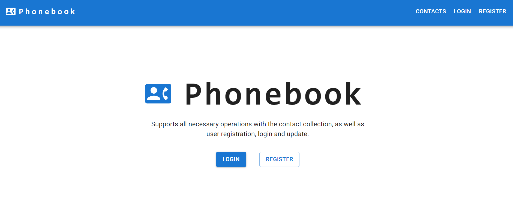
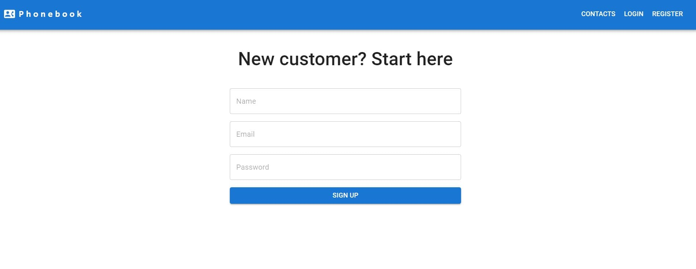
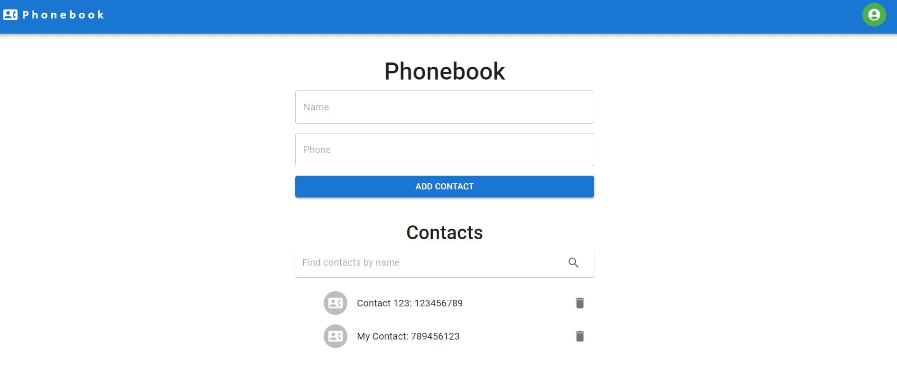

# Phonebook App

The “Phonebook App” program has been implemented with the possibility of
registration, login, and user update, as well as working with a private
collection of contacts — added routing with the React Router library.

## Table of Contents

- [Features](#features)
- [Technologies Used](#technologies-used)

## Features

- Created a user-friendly single-page application (SPA) for managing contacts,
  demonstrating proficiency in React components and state management with Redux.
- Designed an intuitive interface for adding, viewing, and deleting contacts,
  enhancing user experience and functionality.
- Utilized Redux to manage the application's state, ensuring smooth data flow
  and synchronization among components.
- Employed React Router for seamless navigation and a cohesive user experience.
- Implemented responsive CSS for optimal display on various devices and screen
  sizes.
- A ready-made backend was used for this task. It supports all necessary contact
  collection operations as well as user registration, login, and update using
  JWT.
- Utilized local storage to maintain user contacts and data persistence across
  sessions.
- Successfully deployed the application using GitHub Pages, allowing for easy
  access and evaluation.

## Technologies Used

    Git, GitHub, WebPack, HTML5, CSS, MUI, JavaScript, JSX,
    React, Redux, AXIOS, Rest API

This phone book project is a testament to my front-end development skills and
highlights my capability to create applications that are user-friendly and
functional. I have used modern web technologies, and my work reflects my ability
to solve problems and ensure high-quality code independently.

